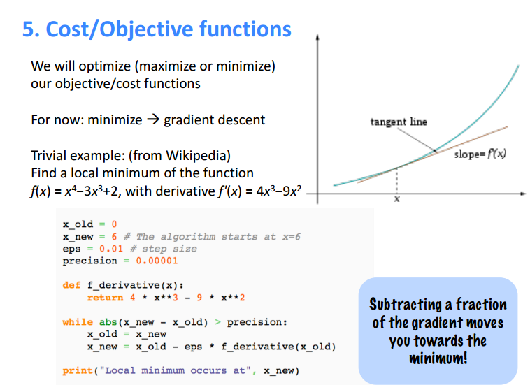
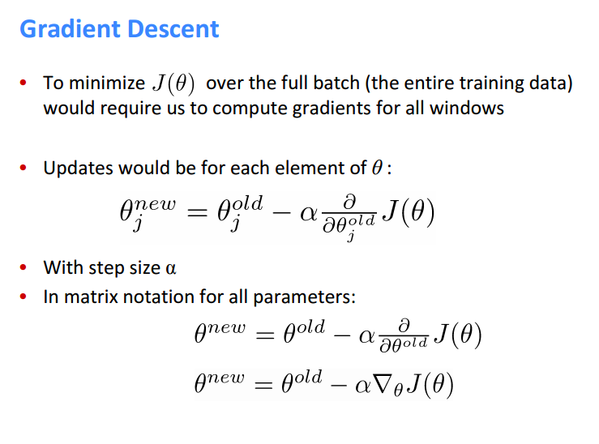
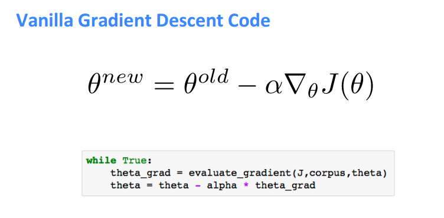
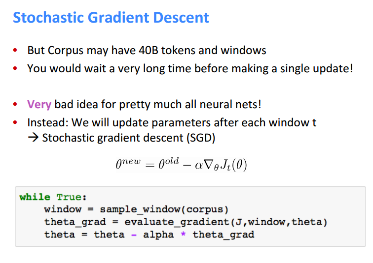

# Word2Vec

## Skip-grams Algorithm

**Skip-grams (SG)** algorithm predicts context words given a target word. This algorithm is independent of the relative positions (offset) of context words and the target word. 

Things we need:
* V (1-by-1): number of words in the vocabulary (eg, 10000)
* d (1-by-1): number of features to describe words (eg, 300)
* W_center (V-by-d): word weight matrix (eg, 10000-by-300) with each row as the weight vector for each word when the word is used as a center word
* W_context (V-by-d): word weight matrix (eg, 10000-by-300) with each row as the weight vector for each word when the word is used as a context word, this matrix is different from the center word weight matrix
* input vector w_c (V-by-1): a **one-hot vector** to represent each word in the vocabulary. For the V elements in the vector, only one element is 1, and all other elements are 0. The input matrix for each word is different.
* output vector (V-by-1): a vector with V float elements to represent p(w|w_c) (the probability that a randomly selected nearby word around the word w_c is that word) for all V words. 

Known: V, d, input vector

Unknown: W_center, W_context, output vector

What we need to do is to train the two weight matrices according to certain rules, and once we get the weight matrices, we are able to calculate the output vector for each center word according to the **softmax form**.

### From weight matrices to output vectors

First, assuming we have already obtained the weight matrices W_center and W_context, the softmax form then tells us about how to compute the output vector.

Softmax:

(from [class slides](http://web.stanford.edu/class/cs224n/lectures/cs224n-2017-lecture2.pdf))

In this algorithm, there are 2 word vectors for each word, namely, **center vector** and **context vector**.
* v_c: word vector associated with the center word
* u_o: word vector associated with word at index o

*Note: all indices here are for the vocabulary, i.e, some number out of V, not necessarily correlated with positions of the word in the resource data.*

v_c = (W_center)'*w_c (d-by-1, the transpose of the center weight matrix times the input matrix of the center word). In other words, this is to get the 1-by-d row in the weight matrix for the word and then transpose it to d-by-1. The d elements in the vector represent the weights for the center word on d features.

u_x = (W_context)'*w_x(d-by-1, the transpose of the context weight matrix times the input matrix of the context word). Same as for v_c, the d elements in the vector represent the weights for the context word on d features. For the softmax formula, we need the weight vector for all V context words, while the special one is u_o.

Then we can plug v_c and u_x's into the softmax formula, and get a V-by-1 vector with each float element as exp(u_o'v_c)/sum(u_x'v_c). For different context words with the same center word, the large nominators are all same.

For different center words, we need to move the window from the index 1 to index V to switch the center word, and do the same things for each center word.

As mentioned at the beginning, the algorithm is indifferent to the offset of the context word relative to the center word. From the output vector, we only know the probability that each word in the vocabulary occurs around a window of size m of the center word. We have no idea about which word will occur on which position (eg, t-1 or t+5).

### Optimize for the weight matrices

The next question for us is, how to get the weight matrices W_center and W_context. One naive and basic training method is to use the softmax form to minimize the loss function.

(from [class slides](http://web.stanford.edu/class/cs224n/lectures/cs224n-2017-lecture2.pdf))

After we plug the conditional probability function p(o|c) into the **objective/loss function**, we are able to derive it on both v_c and u_o for all V words (i.e., all parameters in the model) and get the V-by-1 gradient of the loss function on the v_c vector, and the V-by-1 gradient of the loss function on the u_o vector. With 2 gradients, we are able to do **gradient descent** and get the optimized values of v_c and u_o for each word. The V 1-by-d vectors for v_c make up the rows of W_center, and the V 1-by-d vectors for u_o make up the rows of W_context.

### Gradient descent

Generally in each window we will update all parameters that are **used** in that window (not all 2V word vectors). But in terms of gradient descent, to minimize the objective function over the entire training data, we are required to compute gradients for all windows, or for **all 2V elements of \theta**.

(from [class slides](http://web.stanford.edu/class/cs224n/lectures/cs224n-2017-lecture2.pdf))

The idea of gradient descent: subtracting a small fraction of the gradient/derivative from the estimated parameter will generate a parameter generating a objective value closer to minimum. (This is correct.) Gradient/derivative gives the direction of steepest descent. We can go to the minimum if we walk a little bit each time in the direction. The things is not to move too fast to miss the minimum (step size \alpha).

### Stochastic gradient descent

Because the size of corpus can be very large in real life, in the algorithm of gradient descent, for each update/move we need to compute the derivative for all 2V parameters, which takes forever to finish. 

An idea is in each update we only focus on one window `t`, i.e, **one center word and several context words around it**. We only update the center word vector of the center word and the context word vectors of these context words in each move. Thus, in each move we don't see the majority of the corpus, which incorporates much noise and cannot guarantee a global minimum. But we can move the window to do many such local updates. In fact SGD work well, not only because it is faster, but actually neural networks love noise themselves. 

One useful technique to make the algorithm work well is to randomize the index of window choosen in each move.

(from [class slides](http://web.stanford.edu/class/cs224n/lectures/cs224n-2017-lecture2.pdf))

### Hyper-parameters

In this algorithm, all paramters we focus on optimization are the center weight matrix and the context weight matrix, in other words, the V 1-by-d center word vectors and V 1-by-d context word vectors. But there are other hyperparameters we can adjust to get different model performances.

* m: window size
* d: number of features
